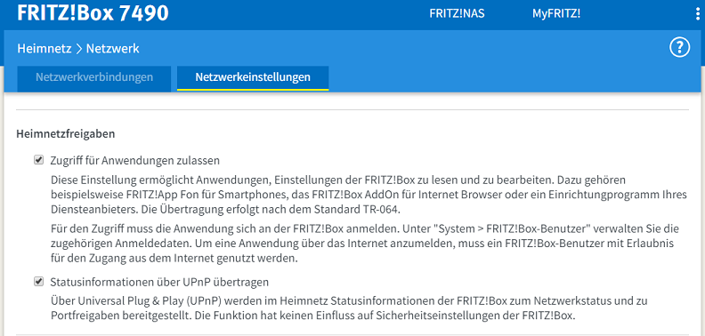
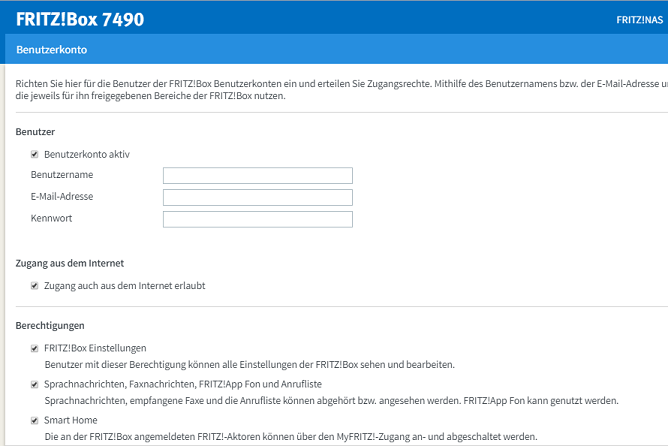
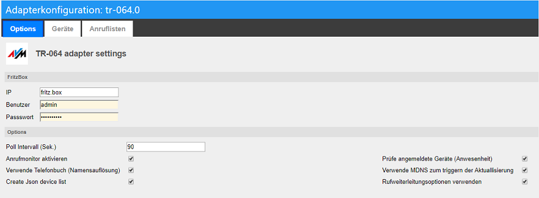
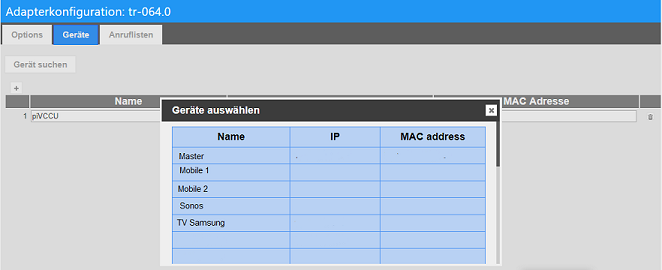
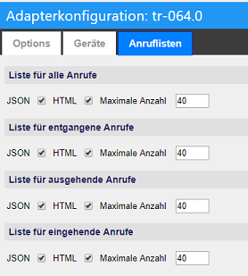
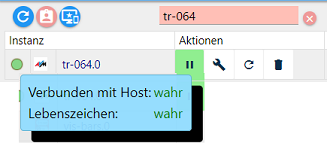
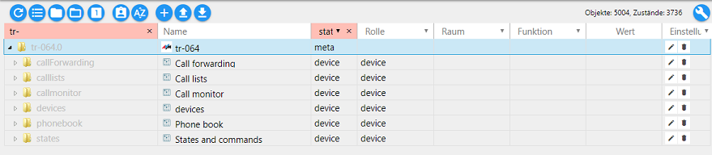
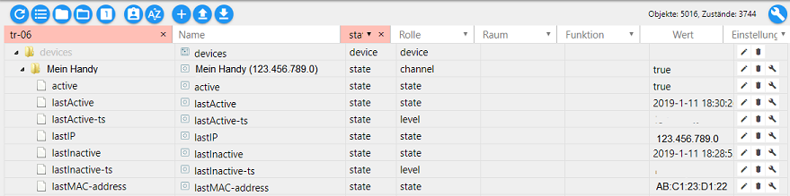

TR-064
========================================

| Stand der Doku | 27.01.2019                                  |
|----------------|---------------------------------------------|
| Entwickler     | soef, bluefox                               |
| Kategorie      | Hardware                                    |
| Keywords       | Fritzbox, AVM, Telefon, Anruf, Anwesenheit, |
| Abhängigkeiten | Freigeschalteter FB-Callmonitor             |
| Lizenz         | MIT                                         |

AVM Fritz!Box®
--------------

Bei der Fritz!Box (Eigenschreibweise des Herstellers AVM) handelt es sich um die
am weitesten verbreiteten Router auf dem Markt.

Es gibt mittlerweile Modelle für alle gängigen Internet-Anschlussarten: DSL-,
Kabel-, Mobilfunk- und Glasfaserzugänge.

Adapter TR-064
----------------

Dieser Adapter liest Information aus der AVM Fritz!Box (kurz: FB) aus
(Schnittstellen basieren auf der [Dokumentation von AVM](https://avm.de/service/schnittstellen/)).

Über diesen Adapter können verschiedene Einstellungen an der FB vorgenommen
werde, wie z.B.

-   An-/Ausschalten WiFi (2,4 GHz und 5 GHz)

-   An-/Ausschalten Gästezugang

-   Reboot FB

Außerdem stellt dieser Adapter Informationen wie z.B.

-   Telefonbuch (Namensauflösung)

-   Geräteliste aller angemeldeten Geräte mit ihrem aktuellen Status

usw. zur Verfügung

Voraussetzungen vor Installation
--------------------------------

Der Datenaustausch erfolgt über den in der FB integrierten *Callmonitor*. Um
diesen zu aktivieren, ruft man von einem angeschlossenen Telefon folgende Nummer
an:

> \#96\*5\* – Callmonitor einschalten

> \#96\*4\* – Callmonitor ausschalten

Als nächstes sollten in der FB unter "Heimnetz-Netzwerk-Netzwerkeinstellungen-Heimnetzfreigaben" beide Optionen aktiviert werden (s. Grafik).

  
*Netzwerkeinstellung FB*

Zur Nutzung weiterer Komfortfunktionen wird folgende Vorgehensweise empfohlen:

-   Anlage eines neuen Nutzers in der FB

    -   Administrator-Berechtigung (s. Grafik, Berechtigung Pkt. 1)

    -   Berechtigung Sprach-, Faxnachrichten … (s. Grafik, Berechtigung Pkt. 2)

    -   Smart Home (bei Bedarf, s. Grafik, Berechtigung Pkt. 3)

  
*Einstellungsseite FB*

Konfiguration
-------------

  
*Konfiguration (öffnet sich nach erfolgreicher Installation einer Instanz automatisch)*

### Options

**Fritzbox**

Zugangsdaten FB (bspw. die Daten eines neu angelegten Benutzers)

**Options**

Aktivierung von

-   Polling (Intervall sollte nicht zu kurz eingestellt sein)

-   Anrufmonitor (zur Darstellung von Gesprächen (ankommend, gehend, verpasst
    usw.)

-   Telefonbuch (Namensanzeige statt Telefonnummer)

-   Geräteliste (gemäß Auswahl unter Geräte)

-   Anwesenheitsprüfung

-   Verwendung MDNS (Automatismus; reduziert Datenlast im Netz)

-   Rufweiterleitungsoption

### Geräte

Hier werden die Geräte ausgewählt, die in der Geräteliste aufgeführt werden
sollen. Hier kann entweder über das „+“-Symbol ein Gerät mit IP
und/oder MAC-Adresse eingegeben werden.

   
*Auswahl der zu überwachenden Geräte*

Oder komfortabler über den Button *Geräte suchen*: Es erscheint eine
Auswahlliste (s. Grafik), wo alle bereits in der FB bekannten Geräte (inkl. IP +
MAC) angezeigt werden. Man kann in der Liste scrollen und per Mausklick die gewünschten Geräte zur Überwachung hinzufügen.

### Anruflisten
   
*Auswahl der gewünschten Liste, deren Format sowie maximale Anzahl gelisteter Anrufe*

Aktivierung der gewünschten Liste; es stehen die Formate JSON und HTML zur
Verfügung.

Instanz
-------

Unter *Instanzen* des ioBrokers finden sich die installierte Instanz des
Adapters. Links ist im Ampelsystem visualisiert, ob der Adapter aktiviert und
verbunden ist.

   
*Ideal: Instanzampel grün*

Platziert man den Mauszeiger auf ein Symbol, erhält man Detailinformationen.

Objekte
-------

  
*Die Ordner im Root-Verzeichnis der Instanz*

Je nach den gewählten Einstellungen finden sich in der Objektliste mehrere
Ordner, die die jeweiligen Informationen beinhalten. Nachfolgend eine kurze
Beschreibung der wichtigsten Information.

### callForwarding

Hier kann für unbekannte oder im Telefonbuch enthaltene separat festgelegt
werden, ob ein ankommender Anruf erfasst (true) wird.

### Calllists

Hier können die Daten aus den verschiedenen Anruflisten eingesehen werden.

Zur Verfügung gestellt werden jeweils die Datenpunkte

-   Count = der Zähler der jeweiligen Auswahl (Reset durch Eingabe „0“)

-   HTML bzw. JSON = Liste im jeweiligen Format

Es gibt Anruflisten für alle (all), ankommende (inbound), verpasste (missed)
sowie ausgehende (outbound) Gespräche.

Unter htmlTemplate kann HTML-Ausgabe angepasst werden (z.B. um nicht erforderliche Informationen auszulassen).

### Callmonitor

Umfangreiche Informationen zu Anrufen in Realtime; es gibt Anruflisten für alle
(all), ankommende (*inbound*), verpasste (*missed*), letzter Anruf (*last call*)
sowie ausgehende (*outbound*) Gespräche.

Folgende Datenpunkte stehen zur Verfügung:

| **Datenpunkt** | **Definition**                                                |
|----------------|---------------------------------------------------------------|
| callee         | Angerufener                                                   |
| caller         | Anrufer                                                       |
| callerName     | Name des Anrufers (aus Telefonbuch)                           |
| imageurlcallee | Bildadresse des Angerufenen (s. FAQ)                          |
| imageurlcaller | Bildadresse des Anrufers (s. FAQ)                             |
| json           | Bereitstellung als JSON-Table                                 |
| Timestamp      | Zeitstempel                                                   |
| *type*         | *Art des letzten Anrufs (connect, missed …), (bezieht sich lediglich auf den letzen Anruf)* |

Zudem stehen hier noch folgende Datenpunkte zur Verfügung:

| **Datenpunkt** | **Funktion**                                                                                                                                                                                                                                                                                                                         |
|----------------|--------------------------------------------------------------------------------------------------------------------------------------------------------------------------------------------------------------------------------------------------------------------------------------------------------------------------------------|
| ringing        | True = Signal für eingehenden Anruf                                                                                                                                                                                                                                                                                                     |
| toPauseState   | Hiermit kann bei Klingeln oder Abheben eine Aktion gestartet werden, die z.B. die Lautstärke eines Endgerätes absenkt und nach Beendigung des Gespräches den ursprünglichen Wert einstellt. Mögliche Werte: ring, connect, end (Global oder für Endgerät (12:Telefon, 21,22..: Handy-App, 40,41..:AB, je nach vorhandenen Endgeräten) |

### Devices

   
*Ordner mit überwachten Geräten (=aktive Verbindungn in der FB)*

Alle in der Konfiguration hinzugefügten Geräte sind hier aufgelistet. Es können
je Gerät u.a. folgende Datenpunkte eingesehen werden:

-   Letzte IP oder MAC

-   Letzte registrierte Aktivität/Inaktivität

So kann z.B. mit dem Datenpunkt „active“ per Skript auf Anwesenheit geprüft
werden. Dabei wird das Einloggen eines Gerätes ins heimische Netz sofort
erkannt, das Ausloggen (und damit die Abwesenheit) kann allerdings mehrere
Minuten dauern.

### Phonebook

Diese drei Datenpunkte repräsentieren Informationen zu einem Kontakt in dem in
der FB angelegten Telefonbuch; Name oder Nummer sind als Suchfeld vorgesehen
(z.B. für Einbindung in Visualisierung).

Die Abfrage eines in der FB abgelegten Bildes zu dem abgefragten funktioniert
nicht stabil (s. FAQ).

### States

Unter States finden sich diverse Steuerungsfunktionen, die an- oder abgeschaltet
werden können (true/false):

-   Reboot FB

-   WPS

-   WLAN/Gast-WLAN

-   Wiederverbindung Internet

-   Anrufbeantworter

    -   Datenpunkt **ab**: 1=anschalten, 0=abschalten

    -   Datenpunkt **abIndex**: FB bietet bis zu 5 AB, hier ist die entsprechende Nr. des
        anzusteuernden AB einzutragen (0-4; bezieht sich auf die letzte Zahl der
        internen Rufnummer)

-   ring: Eingabe einer internen oder externen Rufnummer lässt das entsprechende
    Endgerät klingeln

-   command/commandResult: für versierte Programmierer; zur Nutzung in Skripten
    u.ä.

FAQ
===

F: Warum werden die Bilder meiner Kontakte nicht angezeigt?

A: Durch Verbesserung der Sicherheit wurde von AVM die Software der FB
optimiert. Dadurch wird die Generierung eines Sicherheitsschlüssels erforderlich
(SID). Dies ist noch nicht im Adapter implementiert.

F: Einige JSON-Tabellen werden nicht korrekt dargestellt (Visualisierung VIS,
JSON-Widget).

A: Möglicherweise liegt die Ursache in einer inkorrekten Datenübermittlung.
Entsprechender Issue wurde in Github bereits erstellt.
